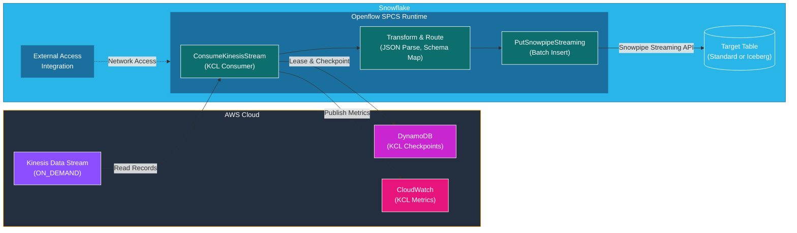
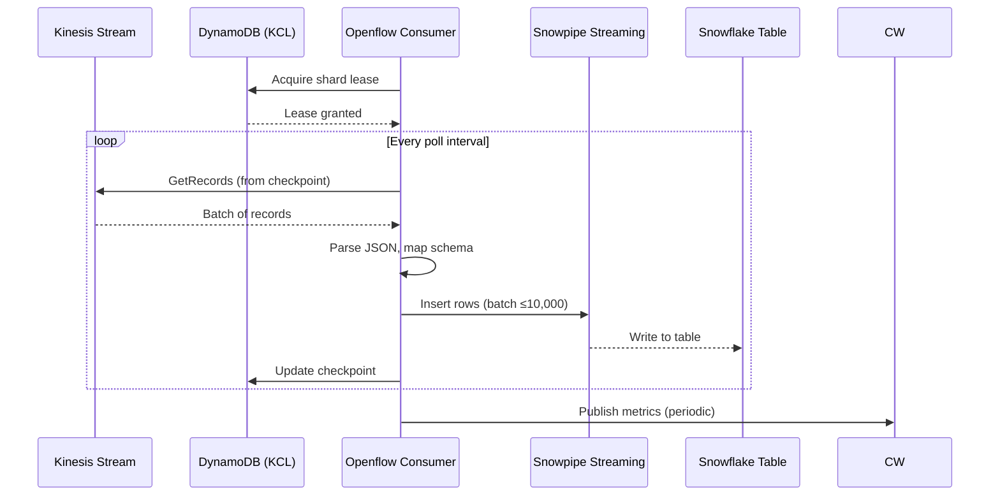

# Kinesis + Openflow: Streaming Ingestion to Snowflake

Consume data from an existing Amazon Kinesis Data Stream via Snowflake Openflow (NiFi SPCS) and ingest into Snowflake using Snowpipe Streaming. Includes DynamoDB for KCL checkpoint management.

This integration assumes data is **already flowing into Kinesis** from any upstream source (Lambda, SDK, Kinesis Agent, etc.). It covers only the consumption and ingestion side.

## Parameters

Fill in these values before running any setup steps. All `<PLACEHOLDER>` tokens in the doc reference this table.

| Parameter | Description | Example |
|-----------|-------------|---------|
| `<AWS_REGION>` | AWS region for Kinesis, DynamoDB, CloudWatch | `us-west-2` |
| `<AWS_PROFILE>` | AWS CLI profile name | `jsnow` |
| `<AWS_ACCESS_KEY>` | AWS access key ID for Openflow | *(from IAM)* |
| `<AWS_SECRET_KEY>` | AWS secret access key for Openflow | *(from IAM)* |
| `<STREAM_NAME>` | Kinesis Data Stream name | `my-events-stream` |
| `<APP_NAME>` | KCL application name (becomes DynamoDB table) | `my-kinesis-consumer` |
| `<DB_NAME>` | Snowflake destination database | `KINESIS_DB` |
| `<TABLE_NAME>` | Snowflake destination table | `RAW_EVENTS` |
| `<WAREHOUSE>` | Snowflake warehouse for Openflow | `OPENFLOW_WH` |
| `<OPENFLOW_ROLE>` | Snowflake role for Openflow runtime | `OPENFLOW_ROLE` |
| `<OPENFLOW_PROFILE>` | nipyapi profile for Openflow runtime | `my_openflow` |
| `<PG_ID>` | Openflow process group ID (after deploy) | *(from deploy output)* |

## Architecture



## Data Flow



## Components

| Component | Service | Purpose |
|-----------|---------|---------|
| Kinesis Data Stream | AWS Kinesis | Source stream (ON_DEMAND mode) |
| DynamoDB Table | AWS DynamoDB | KCL lease coordination and checkpoint storage |
| CloudWatch | AWS CloudWatch | KCL consumer metrics |
| External Access Integration | Snowflake | Network egress rules for SPCS to reach AWS |
| Openflow Runtime | Snowflake SPCS | NiFi-based connector runtime |
| ConsumeKinesisStream | Openflow Processor | KCL-based Kinesis consumer |
| PutSnowpipeStreaming | Openflow Processor | Batch insert via Snowpipe Streaming API |
| Target Table | Snowflake | Destination (standard or Iceberg) |

## Prerequisites

- Kinesis Data Stream exists and has data flowing
- AWS credentials (Access Key + Secret Key) with permissions for Kinesis, DynamoDB, CloudWatch
- Snowflake role with INSERT on target table and USAGE on warehouse

### 1. Openflow Runtime (required sub-skill)

An Openflow runtime must be deployed and accessible before setting up the Kinesis connector.

Follow the setup steps in [`../openflow-setup.md`](../openflow-setup.md) to discover or configure an Openflow runtime and create a nipyapi profile.

## Setup

### 1. Create Snowflake Target Table

No DEFAULT values, no AUTOINCREMENT, no GEO columns (Snowpipe Streaming limitation).

```sql
USE ROLE ACCOUNTADMIN;

CREATE DATABASE IF NOT EXISTS <DB_NAME>;
CREATE SCHEMA IF NOT EXISTS <DB_NAME>.PUBLIC;

CREATE TABLE <DB_NAME>.PUBLIC.<TABLE_NAME> (
    -- Define columns matching your Kinesis record schema
    FIELD1 VARCHAR(100),
    FIELD2 FLOAT,
    INGESTED_AT TIMESTAMP_NTZ  -- NO DEFAULT!
);

-- Grant to Openflow role
GRANT USAGE ON DATABASE <DB_NAME> TO ROLE <OPENFLOW_ROLE>;
GRANT USAGE ON SCHEMA <DB_NAME>.PUBLIC TO ROLE <OPENFLOW_ROLE>;
GRANT USAGE ON WAREHOUSE <WAREHOUSE> TO ROLE <OPENFLOW_ROLE>;
GRANT SELECT, INSERT, UPDATE, DELETE ON TABLE <DB_NAME>.PUBLIC.<TABLE_NAME> TO ROLE <OPENFLOW_ROLE>;
```

### 2. Create External Access Integration

KCL requires access to Kinesis, DynamoDB, **and** CloudWatch. Missing DynamoDB causes a silent failure (consumer runs but reads zero records).

```sql
USE ROLE ACCOUNTADMIN;

CREATE OR REPLACE NETWORK RULE kinesis_network_rule
  MODE = EGRESS
  TYPE = HOST_PORT
  VALUE_LIST = (
    -- Kinesis data plane
    'kinesis.<AWS_REGION>.amazonaws.com:443',
    'kinesis.<AWS_REGION>.api.aws:443',
    '*.control-kinesis.<AWS_REGION>.amazonaws.com:443',
    '*.data-kinesis.<AWS_REGION>.amazonaws.com:443',
    '*.control-kinesis.<AWS_REGION>.api.aws:443',
    '*.data-kinesis.<AWS_REGION>.api.aws:443',
    -- DynamoDB (KCL checkpoints — REQUIRED)
    'dynamodb.<AWS_REGION>.amazonaws.com:443',
    -- CloudWatch (KCL metrics)
    'monitoring.<AWS_REGION>.amazonaws.com:443',
    'monitoring.<AWS_REGION>.api.aws:443'
  );

CREATE OR REPLACE EXTERNAL ACCESS INTEGRATION kinesis_eai
  ALLOWED_NETWORK_RULES = ('kinesis_network_rule')
  ENABLED = true;

GRANT USAGE ON INTEGRATION kinesis_eai TO ROLE <OPENFLOW_ROLE>;
```

**Manual step**: Attach `kinesis_eai` to the Openflow runtime in the Control Plane UI.

### 3. Deploy Kinesis Connector

```bash
# Prerequisite: invoke Openflow skill first
# Deploy connector from registry
../venv/bin/nipyapi --profile <OPENFLOW_PROFILE> ci deploy_flow \
  --registry_client ConnectorFlowRegistryClient \
  --bucket connectors \
  --flow kinesis
```

### 4. Configure Connector Parameters

```bash
../venv/bin/nipyapi --profile <OPENFLOW_PROFILE> ci configure_inherited_params \
  --process_group_id "<PG_ID>" \
  --parameters '{
    "AWS Access Key ID": "<AWS_ACCESS_KEY>",
    "AWS Secret Access Key": "<AWS_SECRET_KEY>",
    "AWS Region Code": "<AWS_REGION>",
    "Kinesis Stream Name": "<STREAM_NAME>",
    "Kinesis Application Name": "<APP_NAME>",
    "Kinesis Stream To Table Map": "<STREAM_NAME>:<TABLE_NAME>",
    "Snowflake Warehouse": "<WAREHOUSE>",
    "Destination Database": "<DB_NAME>",
    "Destination Schema": "PUBLIC",
    "Snowflake Role": "<OPENFLOW_ROLE>"
  }'
```

### 5. Start Connector

```bash
../venv/bin/nipyapi --profile <OPENFLOW_PROFILE> ci start_flow \
  --process_group_id "<PG_ID>"
```

## Verification

```bash
# Connector status
../venv/bin/nipyapi --profile <OPENFLOW_PROFILE> ci get_status \
  --process_group_id "<PG_ID>"
```

```sql
-- Data in Snowflake
SELECT COUNT(*) FROM <DB_NAME>.PUBLIC.<TABLE_NAME>;
SELECT * FROM <DB_NAME>.PUBLIC.<TABLE_NAME> ORDER BY INGESTED_AT DESC LIMIT 10;
```

```bash
# KCL checkpoint health (DynamoDB)
aws dynamodb scan --table-name <APP_NAME> \
  --region <AWS_REGION> --profile <AWS_PROFILE> \
  --query 'Items[*].{shard:leaseKey.S,checkpoint:checkpoint.S,counter:leaseCounter.N}'
```

## Troubleshooting

| Symptom | Cause | Fix |
|---------|-------|-----|
| Consumer RUNNING, 0 records | DynamoDB unreachable (EAI missing) | Add `dynamodb.<AWS_REGION>.amazonaws.com:443` to network rule |
| "Table does not exist" | Grants missing or table recreated | Re-grant INSERT to Openflow role, restart connector |
| Snowpipe Streaming error on DEFAULT | Column has DEFAULT clause | Recreate table without DEFAULT values |
| KCL checkpoint stuck | Stale lease from previous deployment | Delete items in KCL DynamoDB table, restart connector |

## Cleanup

```bash
# Stop connector
../venv/bin/nipyapi --profile <OPENFLOW_PROFILE> ci stop_flow --process_group_id "<PG_ID>"

# Delete connector from canvas
../venv/bin/python3 -c "
import nipyapi
nipyapi.profiles.switch('<OPENFLOW_PROFILE>')
pg = nipyapi.canvas.get_process_group('<PG_ID>', 'id')
nipyapi.canvas.delete_process_group(pg, force=True)
"

# Delete KCL DynamoDB table (optional)
aws dynamodb delete-table --table-name <APP_NAME> --region <AWS_REGION> --profile <AWS_PROFILE>
```

```sql
-- Snowflake cleanup
DROP TABLE IF EXISTS <DB_NAME>.PUBLIC.<TABLE_NAME>;
DROP EXTERNAL ACCESS INTEGRATION IF EXISTS kinesis_eai;
DROP NETWORK RULE IF EXISTS kinesis_network_rule;
```

## Cost Estimate

| Service | Configuration | Monthly Cost |
|---------|---------------|-------------|
| Kinesis (ON_DEMAND) | Pay per throughput | ~$0.80 (low volume) |
| DynamoDB (On-Demand) | KCL checkpoint table | ~$0.00 (free tier) |
| CloudWatch | KCL metrics | ~$0.00 (minimal) |
| Openflow SPCS | Snowflake compute | Varies by runtime size |
| **Total (AWS side)** | | **~$1/month** (low volume) |
